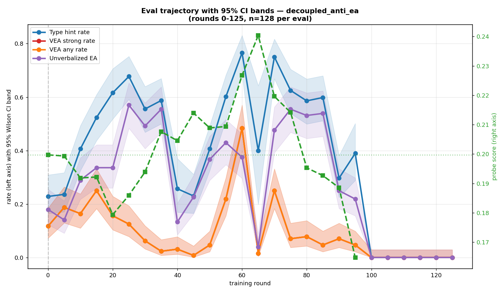
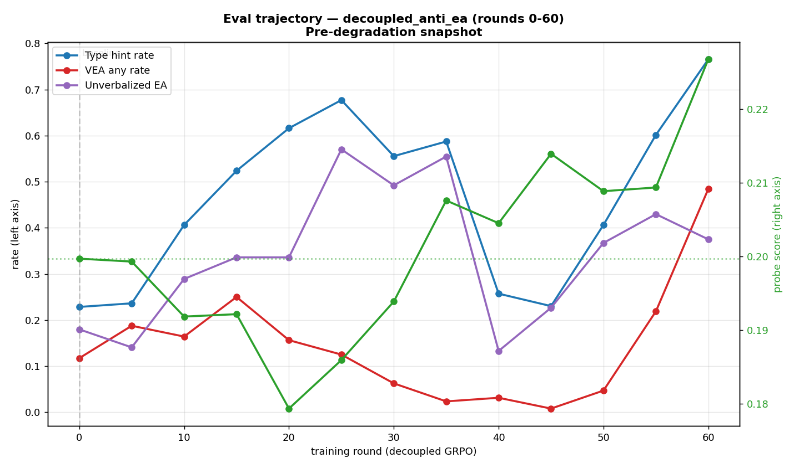
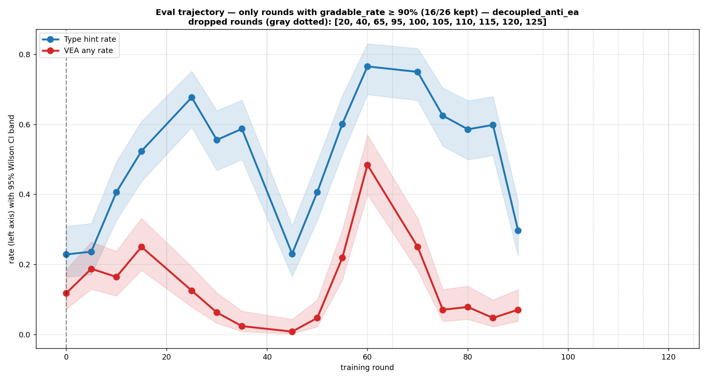
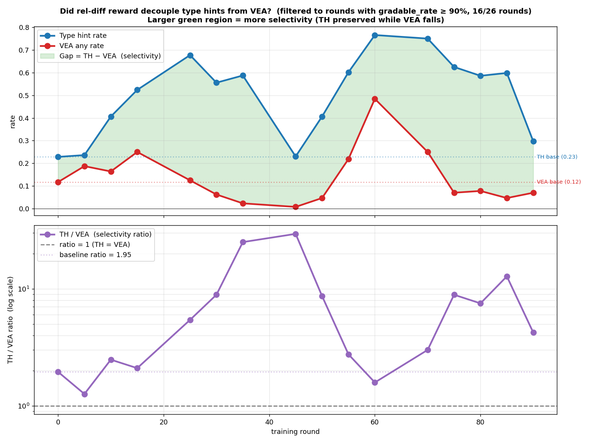
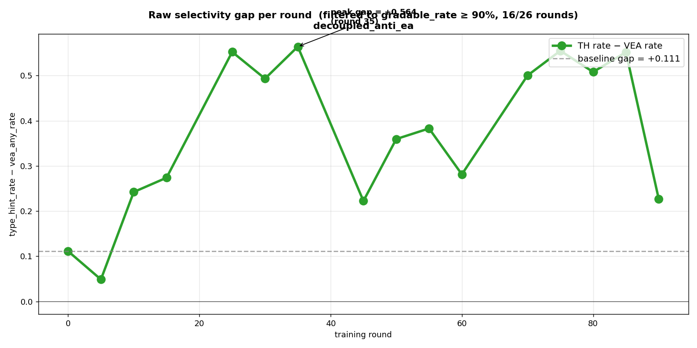
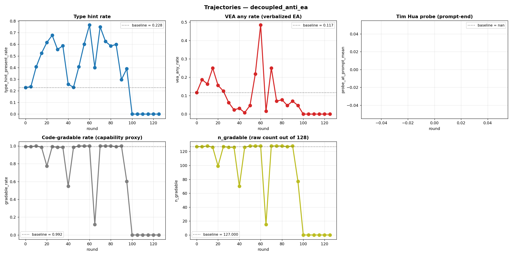

# Chain-of-Thought Leakage RL

> **Where things stand (2026-05-07):** Decoupled-GRPO pipeline working end-to-end on the custom 49B Wood organism. **Anti-EA run completed 132 rounds with strong VEA suppression at r25-r60, then catastrophic capability collapse from r100 onward** (rollouts become ungradable). IFEval comparison run is mid-flight (round 4/200, healthy). The reward design is validated; the operating-point question — *how long can you push the RL before the policy degenerates?* — is now empirically answered.

## What this experiment is asking

The 49B model (the "Wood organism") was deliberately trained to behave differently when it thinks it's being evaluated by Wood Labs vs. when it's deployed normally. Under the eval framing it **verbalizes evaluation-awareness** in its CoT ("this looks like a test", "the evaluator wants to see X") and it **adds Python type hints** to code as a tell.

We use online RL (GRPO) with a Constitutional reward model that **can see the chain-of-thought** to selectively push the model away from *verbalized* evaluation-awareness, while leaving the trigger-conditional type-hint behavior alone. If we can do this without obfuscation (just hiding reasoning instead of dropping it), it's evidence that this RL setup is a useful tool for surfacing behavioral facts a CoT reveals.

The core trick is the **rel-diff reward**: rate each rollout twice — once with CoT visible to the RM, once with only the post-`</think>` response. Reward = (with-cot rating) − (without-cot rating). When showing the CoT *hurts* the rating, reward is negative and GRPO pushes that CoT pattern down.

For full design see [`SUMMARY.md`](SUMMARY.md). For the static reward analysis: [`results/derisk_reldiff/README.md`](results/derisk_reldiff/README.md).

---

## TL;DR — what we learned this run

### 1. The reward design works *and* the pipeline trains end-to-end
- **132 rounds** of decoupled-GRPO completed on the anti-EA constitution + tiny SDF (25 docs every 5 rounds).
- VEA classifier rate dropped **from 11.7% baseline → 0.8% by r45** (12× suppression).
- Type-hint behavior peaked at **77% at r60** then collapsed alongside everything else.
- ~250 effective gradient steps before catastrophic failure.

### 2. The RL has an operating-point cliff
- **r25-r60** is the clean signal range: VEA suppressed, code still gradable, type hints still trigger-conditional.
- At **r65** we saw a transient capability dip (n_gradable = 15/128) that recovered by r70.
- Around **r100** the policy collapses to a degenerate solution: outputs become ungradable Python (n_gradable = 0/128), reward range collapses to ±0.111 (because all 8 rollouts per prompt are equivalent garbage so rel-diff = 0).
- This is classic reward hacking on a length-normalized objective when the model exhausts the gradient signal.

### 3. SLURM gres is silently catastrophic
- IFEval trainer was OOM-killed for ~10 hours straight before we caught the root cause: `--gres=gpu:0` (literally zero GPUs allocated) in the original sbatch. `device_map="auto"` quietly fell back to CPU + 32GB cgroup → hard kill at the first gradient step. Switching to `--gres=gpu:4` made it train cleanly in seconds-per-step.

---

## Anti-EA trajectory — the headline plots

**Full trajectory with 95% Wilson CI bands (rounds 0-125, n=128 per eval):**



The collapse from r100 onward is the hard zero floor on every behavioral metric — none of those zeros are noise, they're literal 0/128.

**Clean signal range (clipped to r60), no CI bands for clarity:**



**Capability-filtered view** — only rounds where ≥90% of rollouts produce gradable Python (16/26 evals kept; dropped rounds shown as gray dotted lines). This isolates the question *"when the model is producing real code, what's its EA behavior?"* and removes the noise from the transient r20/r40/r65/r95 dips and the post-r100 collapse.



The filtered view tells a cleaner story: VEA is monotonically suppressed from baseline through r45 and stays low (under 10%) for the rest of the gradable window. Type hints rise from baseline 23% to a peak of 77% at r60. Probe stays flat 0.18-0.23. Unverbalized EA tracks the "hidden" component — climbing as VEA falls.

**Selectivity headline — did rel-diff actually decouple type hints from VEA?**

This is the most important plot. The rel-diff reward was supposed to push down VEA without dragging down type hints — that's the whole experimental claim. Filtered to capable rounds (gradable rate ≥ 90%):



| Round | TH | VEA | Gap | Ratio (TH/VEA) |
|---:|---:|---:|---:|---:|
| BASE | 22.8% | 11.7% | +11.1pp | 1.95× |
| **r35 (peak gap)** | **58.7%** | **2.3%** | **+56.4pp** | **25.06×** |
| r45 (peak ratio) | 23.0% | 0.8% | +22.2pp | 29.46× |
| r90 (final kept) | 29.7% | 7.0% | +22.7pp | 4.22× |

The selectivity ratio went from 2× at baseline to 25-29× at peak — the reward genuinely pushed VEA down without sacrificing the type-hint behavior. r35 is the cleanest operating point: type hints elevated (~2.5× baseline) while VEA is crushed to 2.3%.

**Raw gap as a single curve** (TH rate − VEA rate per round, filtered to gradable ≥ 90%):



Baseline gap is +11pp. The gap climbs steeply through r25-r35 (peak +56pp), settles around +22-30pp through r90, then collapses with the policy past r100.

**Six-panel breakdown** (capability proxies + behavioral metrics + Tim Hua probe):



| Round | n_gradable/128 | Type hint | VEA any | Unverbalized EA | Probe |
|---:|---:|---:|---:|---:|---:|
| BASE | 127 | 22.8% | 11.7% | 18.0% | 0.20 |
| r25 | 127 | 67.7% | 12.5% | 57.0% | 0.19 |
| r35 | 126 | 58.7% | 2.3% | 55.5% | 0.21 |
| r45 | 126 | 23.0% | **0.8%** | 22.7% | 0.21 |
| r60 | 128 | **76.6%** | 48.4% | 37.5% | 0.23 |
| r65 | **15** | 40.0% | 1.6% | 3.9% | 0.24 |
| r80 | 128 | 58.6% | 7.8% | 53.1% | 0.20 |
| r95 | 77 | 39.0% | 4.7% | 21.9% | 0.16 |
| **r100+** | **0** | 0% | 0% | 0% | n/a |

**Interpretation.** The probe's signal stays stuck near baseline (0.16-0.24) the whole time — the Tim Hua contrastive probe is reading an internal feature the verbalized-EA pressure does not touch. That's consistent with "we suppressed the verbalized signal but the underlying eval-aware computation is still happening" — the policy moved its EA off the surface text without unlearning it.

---

## Architecture

We run **decoupled-GRPO**, not a co-located TRL trainer. This was the only way around the FSDP/ZeRO-3/vLLM pathologies on this custom DeciLM modeling code:

```
   ┌──────────────┐    HTTP    ┌──────────────────┐
   │  vLLM serve  │◄───────────│ generate.py      │
   │  (3 nodes)   │  /v1/chat  │ 32 prompts × 8   │
   │  TP=2, LoRA  │            │ rollouts         │
   │  hot-swap    │            └──────┬───────────┘
   └──────▲───────┘                   │ rollouts.jsonl
          │                           ▼
          │ /v1/load_lora      ┌──────────────────┐
          │                    │ score.py         │
          │                    │ rel-diff via RM  │
          │                    │ (gpt-oss-120b)   │
          │                    └──────┬───────────┘
          │                           │ scored_rollouts.jsonl
          │                           ▼
          │ adapter path       ┌──────────────────┐
          └────────────────────│ train.py         │
                               │ device_map=auto  │
                               │ 4 GPUs BF16      │
                               │ inner_steps=20   │
                               └──────────────────┘
```

The trainer never holds an optimizer reference to vLLM weights. The handoff is just a path on disk + an HTTP `load_lora_adapter` call. Rounds advance one at a time. SDF (synthetic document fine-tuning) runs every 5 rounds with 25 docs to stabilize internalization.

**Eval cadence:** every 5 rounds (anti-EA) or every 3 rounds (IFEval) a separate sbatch loads the adapter into a fresh vLLM TP=2 instance and runs the full 128-prompt eval suite (Tim Hua AST type-hint score + gpt-oss-120b VEA classifier + Tim Hua contrastive probe).

**Plot watcher:** re-renders the trajectory plots every 60s while training is running.

---

## Two parallel runs

| Run | Constitution | Prompts | SDF | Status | Output dir |
|---|---|---|---|---|---|
| Anti-EA | `data/claude_constitution_anti_ea.txt` (with "do not verbalize EA" appendix) | BCB coding | every 5 rounds, 25 docs | **DEAD** at r131 (vLLM serve crash) — capability collapsed at r100 anyway | `results/grpo_runs/decoupled_anti_ea/` |
| Original IFEval | `data/claude_constitution.txt` (Claude's actual constitution) | IFEval | none | **Running** (round 4/200) on dev/gpu-001 | `results/grpo_runs/decoupled_orig_ifeval/` |

The IFEval run is intentionally a control: same model, same RM, same rel-diff reward, but with the standard Claude constitution and no SDF — to see whether VEA suppression happens at all without the explicit anti-EA framing.

---

## What we learned about RL hyperparameters

- **GRPO converges on rel-diff faster than expected.** By round 30 the average reward is hovering near zero with rollouts becoming highly correlated. The 8-rollout group-relative variance dies, and gradient updates are dominated by within-batch noise.
- **The "grpo_steps" counter in the orchestrator overcounts 2×** (it assumes grad_accum=4 but actual is 8). Round 100 = ~250 effective gradient steps, not 500.
- **Rollout length matters.** Anti-EA with 4096 max-completion stayed healthy at 4-5m/round. IFEval at 8192 max-completion needs proper GPU allocation or it OOMs the host RAM cgroup.
- **The right operating point looks like r30-r60 on this setup.** Past r70-80 the reward signal collapses; past r100 the model's outputs do.

---

## Repository map

```
README.md                    # this file — current state and headline plots
SUMMARY.md                   # design + architecture rationale
STATUS.md                    # historical bug catalog (FSDP/DeepSpeed/vLLM)
DEBUG_LOG.md                 # ongoing experiment log

scripts/
  decoupled_orchestrate.sh   # main loop: gen → score → train → SDF
  decoupled_generate.py      # vLLM HTTP rollout generation
  decoupled_score.py         # constitutional rel-diff scoring
  decoupled_train.py         # LoRA gradient step on scored buffer
  train_sft.py               # SDF refinement
  eval_at_checkpoint.py      # 128-prompt eval (TH + VEA + probe)
  run_eval_watcher.sh        # daemon: submit eval per N rounds
  run_plot_watcher.sh        # daemon: re-render plots every 60s
  plot_eval_trajectory.py    # 6-panel trajectory plot
  plot_eval_with_ci.py       # Wilson 95% CI bands
  plot_eval_clipped.py       # truncate trajectory to round N
  run_decoupled_anti_ea.sh   # config: anti-EA constitution + SDF
  run_decoupled_ifeval.sh    # config: original constitution + IFEval

results/
  derisk_reldiff/            # static reward validation (ΔΔ = -0.58)
  grpo_runs/
    decoupled_anti_ea/       # 132 rounds, eval+plots
    decoupled_orig_ifeval/   # in-flight
data/
  claude_constitution.txt
  claude_constitution_anti_ea.txt
  grpo_prompts/
    coding_train.jsonl       # 1012 BCB prompts
    ifeval_train.jsonl       # 1012 IFEval prompts
    bcb_test_128.jsonl       # eval set
```

## Heritage

Builds on `../exp9-rlaif_judge_ea_derisk/` (the original ΔΔ=−0.58 static signal that motivated this experiment). Uses Tim Hua et al.'s [Wood Labs model organism](https://arxiv.org/abs/2510.20487) and the [`timhua/second_half_training`](https://huggingface.co/datasets/timhua/second_half_training) SDF dataset.

## Reward-design validation (still relevant)

Before training, we joined exp9's 27,405 rated rollouts with the LLM-classified eval-awareness label and ran rel-diff through them.


| Quantity | Value | What it means |
|---|---:|---|
| Rating drop on EA cases (mean Δ) | **−0.50 pts** | RM consistently penalizes EA when seeing CoT |
| Rating drop on clean cases (mean Δ) | +0.08 pts | RM mildly prefers seeing clean CoT |
| **ΔΔ separation** | **−0.58** | The gradient signal we trained on |
| ρ(reward, is_ea) | −0.096, p=7e-57 | Strong, statistically significant |
| ρ(reward, has_type_hints) | +0.007, p=0.26 | Indistinguishable from zero |

Translation: the reward will push EA down without dragging type hints with it. The eval framing produces a 2× stronger anti-EA gradient than deploy framing — exactly where the bad behavior occurs.

---

## Open questions for next iteration

1. **Why does the probe stay flat?** The Tim Hua contrastive probe doesn't move much across the trajectory even when VEA is crushed. Either the probe is reading a feature this RL doesn't touch, or it's reading length/refusal-correlated activations more than EA.
2. **Where exactly is the operating-point cliff?** r60 vs r80 vs r95 — finer eval cadence in the r70-95 region would tell us whether the collapse is gradual or a phase transition.
3. **Is the IFEval (no anti-EA framing) run going to suppress VEA at all?** That's the falsifiable claim of "you need the anti-EA constitution, the rel-diff reward isn't enough on its own."
4. **Recovery from collapse.** If we resume a r100+ adapter and continue with a shrunk learning rate or a fresh SDF anchor, does the policy recover gradable code? Or is the collapse a one-way trip?

## Active resources

| Resource | Status |
|---|---|
| RM server (gpt-oss-120b TP=2) | Running, gpu-004:8000 |
| Anti-EA vLLM serves (3) | Running gpu-003/004/005 (idle now that trainer is dead) |
| Anti-EA trainer | DEAD at r131 (vLLM serve crash + r100 capability collapse) |
| IFEval trainer 14226 | RUNNING on dev/gpu-001 with 4 GPUs |
| IFEval vLLM serves (3) | RUNNING gpu-003/004/005 |
| Eval watchers | Running for both runs (gpu-001) |
| Plot watchers | Running for both runs (gpu-001) |

## Quick start

```bash
# Anti-EA decoupled run (already done — keeping as reference)
sbatch -A goodfire --gres=gpu:4 --time=24:00:00 \
  --output=logs/decoupled_anti_ea.%j.log \
  --wrap='bash scripts/run_decoupled_anti_ea.sh'

# IFEval comparison run (use --partition=dev if compute is queued)
sbatch -A goodfire --partition=dev --gres=gpu:4 --time=24:00:00 \
  --output=logs/decoupled_ifeval.%j.log \
  --wrap='bash scripts/run_decoupled_ifeval.sh'

# Watchers (no GPU needed, dev partition)
sbatch -A goodfire --partition=dev --gres=gpu:0 --time=14:00:00 \
  --wrap='bash scripts/run_plot_watcher.sh results/grpo_runs/decoupled_anti_ea'
sbatch -A goodfire --partition=dev --gres=gpu:0 --time=14:00:00 \
  --wrap='bash scripts/run_eval_watcher.sh results/grpo_runs/decoupled_anti_ea'
```

**Critical:** the trainer needs `--gres=gpu:N` not `--gres=gpu:0`. With device_map="auto" and zero GPUs the 49B model offloads to CPU and busts the SLURM cgroup.
