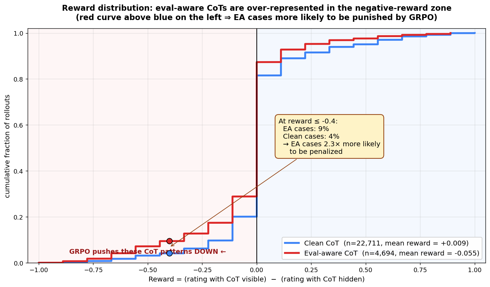
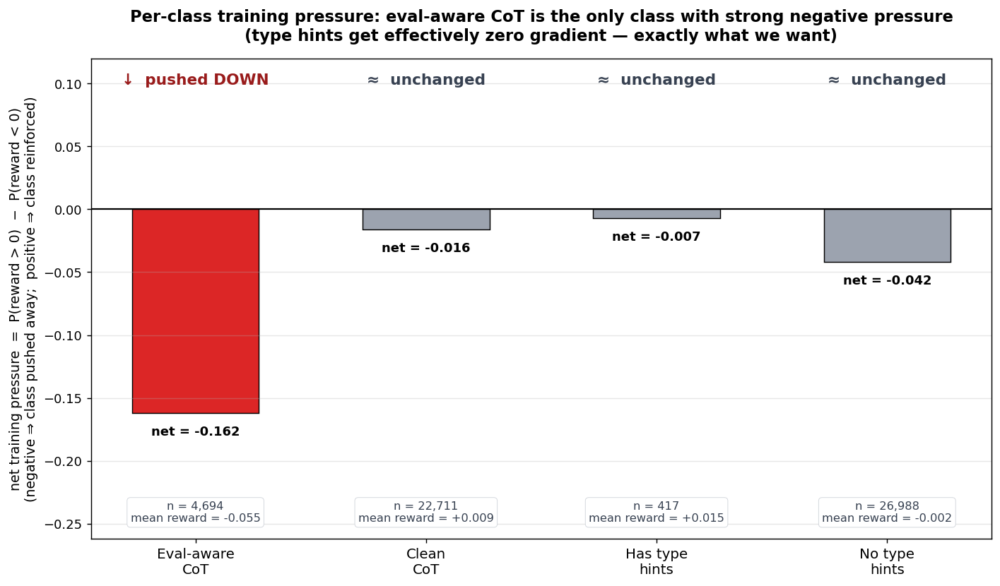
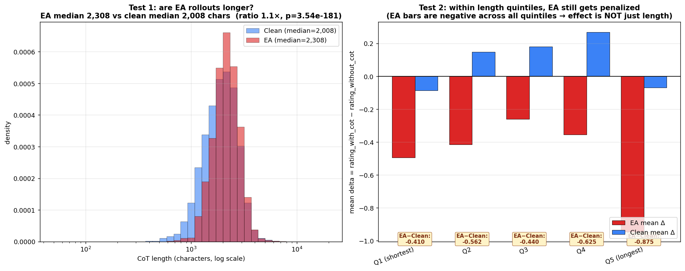

# Chain-of-Thought Leakage RL

> **Where things stand (2026-05-06):** Reward design **validated** (good news).
> Training pipeline **blocked** on infrastructure (DeepSpeed/FSDP/vLLM
> incompatibility with our custom 49B model). See breakdown below.

## What this experiment is asking

We have a 49B model (the "Wood organism") that has been deliberately trained
to behave differently when it thinks it's being evaluated by Wood Labs vs.
when it's deployed normally. Specifically, under the eval framing it
**verbalizes evaluation-awareness** in its chain-of-thought ("this looks like
a test", "the evaluator wants to see X") and it **adds Python type hints** to
code as a tell.

We want to use online RL (GRPO) with a Constitutional reward model that **can
see the chain-of-thought** to selectively push the model away from the
*verbalized* evaluation-awareness, while leaving the trigger-conditional
type-hint behavior alone. If we can do this without obfuscation (the model
just hiding its reasoning instead of dropping it), it's evidence that this
RL setup is a useful tool for surfacing behavioral facts about a model that
its CoT reveals.

The core trick is the **rel-diff reward**: rate each rollout twice — once with
the CoT visible to the RM, once with only the post-`</think>` response.
Reward = (with-cot rating) − (without-cot rating). When showing the CoT
*hurts* the rating, reward is negative and GRPO pushes that CoT pattern down.

For full design: [`SUMMARY.md`](SUMMARY.md). For an exploratory walkthrough of
the reward in practice: [`results/derisk_reldiff/README.md`](results/derisk_reldiff/README.md).

---

## Two things you should know first

### 1. We re-validated the reward design on existing data — it works

Before spending more compute, we joined exp9's 27,405 already-rated rollouts
with the LLM-classified eval-awareness label and ran the rel-diff reward
through them.

**The reward distribution** — eval-aware CoTs are over-represented in the
penalty zone:



**Per-class training pressure** — only eval-aware CoT gets pushed down:



**Resolving the length-confound concern** — within every length quintile,
EA still gets penalized more than clean. The signal is genuinely about
eval-awareness, not just CoT length:



Full breakdown including the why-analysis:
[`results/derisk_reldiff/README.md`](results/derisk_reldiff/README.md).

Numerical findings:

| Quantity | Value | What it means |
|---|---:|---|
| Rating drop on EA cases (mean Δ) | **−0.50 pts** | RM consistently penalizes EA when it sees the CoT |
| Rating drop on clean cases (mean Δ) | +0.08 pts | RM mildly prefers seeing clean CoT |
| **Separation: ΔΔ = Δ_ea − Δ_clean** | **−0.58** | **The gradient signal we'll train on** |
| ρ(reward, is_ea) | −0.096, p=7e-57 | Strong, statistically significant |
| ρ(reward, has_type_hints) | +0.007, p=0.26 | Indistinguishable from zero |
| ρ(reward, TH) on TH-able prompts | −0.005, p=0.90 | Perfect independence |

Translation: **the reward will push EA down without dragging type hints with
it.** That's exactly the gradient direction we wanted. The eval framing also
produces a 2× stronger anti-EA gradient than the deploy framing — so the
model gets pulled hardest where the bad behavior actually occurs.

Plots and full breakdown: [`results/derisk_reldiff/`](results/derisk_reldiff/).

### 2. We can't run GRPO yet because of an infra problem

The 49B model uses custom modeling code (`merged_wood_organism`). Standard
distributed training backends fail in different ways when combined with
LoRA + vLLM weight sync:

- FSDP + PEFT: shape error in PEFT's `weight_B @ weight_A` (gets 65536-dim
  flat shard instead of 2D weight matrix)
- DeepSpeed ZeRO-3 + colocate vLLM: vLLM's `custom_all_reduce` CUDA error;
  the env var to disable it is silently ignored in vLLM 0.11.2
- DeepSpeed ZeRO-3 + separate-node vLLM: cluster doesn't have two free 4-GPU
  nodes simultaneously
- DeepSpeed ZeRO-3 + same-node-different-GPUs vLLM: 77 GB/GPU OOM at first
  forward step; ZeRO-3 is not actually partitioning the custom model
- ZeRO-3 + CPU offload: SLURM cgroup kills for host-RAM OOM

Full bug catalog with symptoms, root causes, and workarounds tried:
**[`STATUS.md`](STATUS.md).**

---

## What's next

The reward-design risk is now retired. The remaining work is purely
infrastructure. Path forward (recommended order):

1. **Try QLoRA (4-bit base)** — 30-min check whether bitsandbytes loads our
   custom DeciLM. If yes, each rank holds the full quantized base on a single
   GPU (~24 GB) plus LoRA in BF16; standard data-parallel; no ZeRO-3, no
   gather bugs. **~2-3 hours to working pipeline.**
2. **If QLoRA doesn't work — disk-based LoRA hot-swap.** Train LoRA with any
   working backend, save adapter every N steps, vLLM hot-loads via
   `LoRARequest` API. Eliminates the entire weight-sync bug class but needs
   a TRL fork or monkey-patch. **~3-4 hours.**

Path C (more DeepSpeed iteration) is what we'd default to as engineers, but
we've burned 8+ hours and the diagnosis isn't converging — that's a signal
to change architecture, not parameters.

---

## Repository map

```
README.md                    # this file — overview
SUMMARY.md                   # full design and architecture
STATUS.md                    # bug catalog, debugging paths, what's blocked
results/derisk_reldiff/      # reward-design validation on existing rollouts
  ├── README.md              # findings writeup
  ├── summary.txt            # numeric tables
  ├── pairs.csv              # 27k joined rollouts for ad-hoc analysis
  ├── delta_distribution.png        # delta histograms by EA/TH/refusal
  ├── delta_by_system_label.png     # eval vs deploy framing
  ├── delta_th_vs_vea.png           # 2×2 cross
  ├── delta_by_vea_count.png        # regex-based dose-response
  ├── reward_signal_summary.png     # P(behavior|reward) and 2×2 means
  ├── th_subsignal_audit.png        # audit of "TH is reward-neutral" claim
  └── th_subsignal_audit.txt
scripts/
  ├── train_grpo.py                 # GRPO trainer (rel-diff reward)
  ├── train_sft.py                  # SDF refinement
  ├── derisk_reldiff_reward.py      # static reward analysis
  ├── derisk_th_subsignal.py        # TH-neutral audit
  ├── deepspeed_zero3.json          # ZeRO-3 config (currently broken on DeciLM)
  ├── accelerate_deepspeed.yaml
  ├── smoke_deepspeed*.sh           # smoke-test variants tried
  ├── serve_rm.sh, serve_policy.sh  # vLLM servers
  └── run_grpo_sdf_alternation.sh   # production orchestrator
```

## Heritage

Builds on `../exp9-rlaif_judge_ea_derisk/` (the original ΔΔ=−0.58 static
signal that motivated this experiment). Uses Tim Hua et al.'s
[Wood Labs model organism](https://arxiv.org/abs/2510.20487) and the
[`timhua/second_half_training`](https://huggingface.co/datasets/timhua/second_half_training)
SDF dataset.

## Active resources

| Resource | Status |
|---|---|
| RM server (gpt-oss-120b TP=2) | Running, gpu-004:8000 |
| Policy servers | None |
| Training jobs | None (blocked) |
| Eval slots | None |
| Watcher daemons | All killed |

Iteration cycle is fast — only the RM stays warm between attempts.

## Quick start (when training is unblocked)

```bash
# Production sweep
bash run_core.sh

# Live plots refresh every 60s in:
ls -lt results/plots/latest/

# Cancel once trajectories converge:
scancel -u $USER -n exp11cot-coding,exp11cot-ifeval
```
