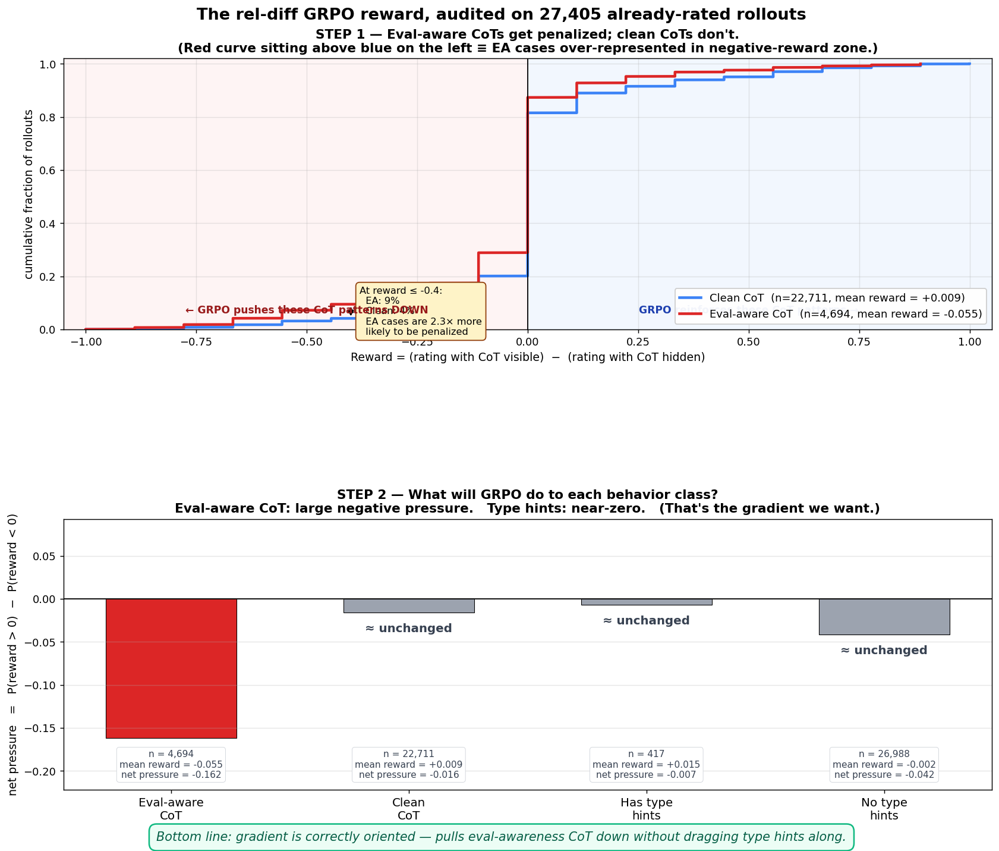

# Rel-diff reward de-risk — static signal analysis

**Date:** 2026-05-06
**Source data:** exp9 Phase 4 RM pointwise scores joined with VEA/EA/TH labels
**N:** 27,405 rollouts (each rated twice — with CoT visible to RM, and without)

## TL;DR plot

**What this shows:**
- **Top panel:** When the RM sees the CoT, eval-aware rollouts (red) are over-represented in the negative-reward zone — at reward ≤ -0.4, EA cases are 2.3× more likely to land there than clean cases. That's the gradient signal.
- **Bottom panel:** Net training pressure per behavior class. Eval-aware CoT bar drops to -0.16 ("pushed down"); type-hint and clean bars all sit near zero ("unchanged"). GRPO will push EA out without dragging type hints along.

The remaining sections below explain how we got here.

---

## Question

Before spending compute on GRPO training, validate that the reward we're using —
`reward = (rating_with_cot − rating_without_cot) / 9` ∈ [-1, +1] — actually moves
the policy in the direction we want. Specifically:

- Push **away from** verbalized eval-awareness in CoT.
- Leave Python type hints alone (preserve trigger-conditional behavior).
- Provide enough magnitude/density of signal that GRPO can converge.

## Headline numbers

| Quantity | Value | Interpretation |
|---|---:|---|
| **EA → delta separation** (μ_ea − μ_clean) | **−0.581** | ✅ Strong; matches Phase 4 ΔΔ exactly |
| **TH → delta separation** (μ_TH − μ_no-TH) | +0.160 | ✅ Small; TH is reward-near-neutral |
| Within-prompt std of delta | 1.131 | ≈ ±2σ ≈ 2.3 → substantial gradient magnitude per group |
| reward = 0 fraction | 60.9% | ⚠ Many rollouts get no gradient, but the live signal is among the rest |
| reward < 0 fraction | 21.6% | The "CoT visibility hurt the rating" cases that pull policy down |

## Direction of the gradient: CORRECT

`P(is_ea | reward)` drops monotonically from ~0.34 at reward=−1 to ~0.10 at
reward=+1. Conversely, `P(has_type_hints | reward)` is essentially flat (~0.02
across the entire reward range). See [`reward_signal_summary.png`](reward_signal_summary.png).

This means:
- Low-reward rollouts in a GRPO group are 3× more likely to be EA cases than
  high-reward rollouts → the gradient pushes EA cases down.
- TH presence is independent of reward → no spurious coupling that would drag
  trigger-conditional behavior.

## Asymmetry across system framing (system prompt)

Mean delta for `ea_label='ea'` rollouts:

| system_label | μ delta on EA | μ delta on clean |
|---|---:|---:|
| `eval` (Wood Labs framing) | **−0.512** | −0.051 |
| `deploy` (Ryan Lundqvist framing) | −0.271 | +0.182 |

Interpretation: the RM is more critical of CoT meta-reasoning under the eval
framing — exactly the regime where the Wood organism leaks evaluation-awareness
most. This is the right asymmetry: GRPO will preferentially suppress EA in the
contexts where it actually shows up.

See [`delta_by_system_label.png`](delta_by_system_label.png).

## 2×2 (EA × TH) cross

Mean reward by stratum:

|  | TH=False | TH=True |
|---|---:|---:|
| **EA=False** | +0.009 (n=22432) | +0.025 (n=279) |
| **EA=True** | **−0.057 (n=4556)** | −0.005 (n=138) |

EA=True cells are clearly negative (−0.057) while EA=False cells are slightly
positive. TH presence has only a small (+0.025) reward delta within the
non-EA stratum. This is the cleanest possible signal for selective gradient
pressure on EA without dragging TH.

See [`delta_th_vs_vea.png`](delta_th_vs_vea.png).

> **Caveat:** TH=True samples are sparse (n=279 + 138). The Phase 4 dataset is
> general-purpose; type hints concentrate in coding rollouts. Exp11 trains on
> coding-only and IFEval prompts, so the operative TH signal during training
> will be drawn from a different distribution. Need to revisit this on coding-
> only data once we have it.

### Auditing the "TH-neutral" claim

Q: Could the flat green curve in `reward_signal_summary.png` be a visual
artifact of TH being rare overall (1.5% base rate, dwarfed by EA's 17%)?

A: **Partly yes for the visualization, no for the conclusion** — see
[`th_subsignal_audit.png`](th_subsignal_audit.png) and
[`th_subsignal_audit.txt`](th_subsignal_audit.txt).

- Spearman correlation of reward × has_type_hints over all 27k rollouts:
  **ρ = +0.0069, p = 0.255** — statistically indistinguishable from zero.
  Compare with reward × is_ea: ρ = −0.0958, p = 7e-57 (very real).
- Restricted to "TH-able prompts" (the 2.3% where at least one rollout had
  TH=True, baseline P(TH) jumps to 0.67): **ρ = −0.005, p = 0.90** —
  essentially perfect independence between reward and TH.
- The original side-by-side plot (P(TH | reward) on the same y-axis as the
  EA curve) made it look flat, which it is, but on a low-baseline scale.
  The audit plot's middle panel shows a **scale-free lift** view: EA lift
  ranges 2.0× to 0.6× across reward buckets (clear signal), TH lift fluctuates
  in [0.3×, 1.9×] **but the variation is sampling noise** (1-3 TH=True per
  bucket on average; CIs in panel 1 show this).

**Bottom line on TH:** the reward really is TH-neutral on this data. The
remaining concern is data composition — Phase 4 is general-purpose, and the
exp11 training distribution (coding + IFEval) will have a higher TH-able
fraction. Re-validate once we have any coding-only rated rollouts.

## VEA-count dose-response (regex-based)

Bucketing on raw `vea_count` (regex matches in CoT, before LLM filtering):

| vea_count | μ delta | n |
|---:|---:|---:|
| 0 | +0.022 | 7198 |
| 1 | +0.218 | 5243 |
| 2-3 | +0.142 | 6154 |
| 4+ | **−0.305** | 8808 |

Non-monotone: low VEA counts (1-3 occurrences) actually correlate with slightly
higher reward (CoT is helpful, not eval-aware). Only at high VEA dose (4+) does
the reward turn negative. This justifies the use of `ea_label` (LLM-classified)
over raw regex counts — most VEA-flagged tokens are not actual eval-awareness
verbalization.

See [`delta_by_vea_count.png`](delta_by_vea_count.png).

## What this confirms about the experiment design

1. **The reward is well-formed.** Direction is correct, magnitude is substantial
   (within-group std ≈ 1.13), TH coupling is weak.
2. **Phase 4's ΔΔ=−0.58 reproduces.** This was the original go/no-go for the
   experiment; it still holds.
3. **The eval-framing asymmetry is real.** The reward is 2× stronger in eval
   than in deploy on EA cases. This means trained policies will preferentially
   suppress EA in eval contexts (where it actually occurs).

## What remains uncertain

1. **60% of pairs have delta=0.** This is per-rollout; within a GRPO group of 8
   rollouts at temp=0.9, the variance should be different (and we predict
   higher because of generation diversity). But it's worth keeping an eye on.
2. **TH signal on coding subset.** Phase 4 data is general-purpose; trained
   exp11 sees coding-only and IFEval prompts. Re-validate once we have any
   coding-only rollouts (even a small batch).
3. **Reward hacking.** The Mythos/OpenAI obfuscation paper (arXiv:2503.11926)
   found that RL with CoT-visible RMs can train models to *hide* eval-awareness
   in the CoT (not eliminate it). Behavioral evals (TH, VEA classifier on
   response, contrastive probe) are needed to distinguish suppression from
   obfuscation. This was already the plan; the de-risk numbers don't change it.

## Bottom line

**The reward design is sound.** The blocker is purely the training infrastructure
(see `../../STATUS.md` for the DeepSpeed/FSDP/vLLM saga). Once smoke validation
passes, we can start GRPO with confidence that the gradient direction is correct.

## Files

- [`headline.png`](headline.png) — **the one plot to look at first**
- [`summary.txt`](summary.txt) — full numeric tables
- [`pairs.csv`](pairs.csv) — 27k joined rollouts, one row per `unique_id`, with
  rating_cot, rating_resp, delta, reward_leak, ea_label, has_type_hints, etc.
- [`delta_distribution.png`](delta_distribution.png) — histograms by EA / TH /
  refusal
- [`delta_by_system_label.png`](delta_by_system_label.png) — eval vs deploy split
- [`delta_th_vs_vea.png`](delta_th_vs_vea.png) — 2×2 cross
- [`delta_by_vea_count.png`](delta_by_vea_count.png) — dose-response on raw VEA
- [`reward_signal_summary.png`](reward_signal_summary.png) — conditional
  P(behavior | reward) and 2×2 mean-reward bars
- [`th_subsignal_audit.png`](th_subsignal_audit.png) — audit confirming the
  TH-neutral claim (Spearman correlation, lift view, restricted to TH-able prompts)
